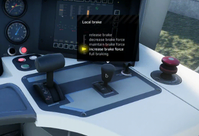
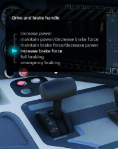
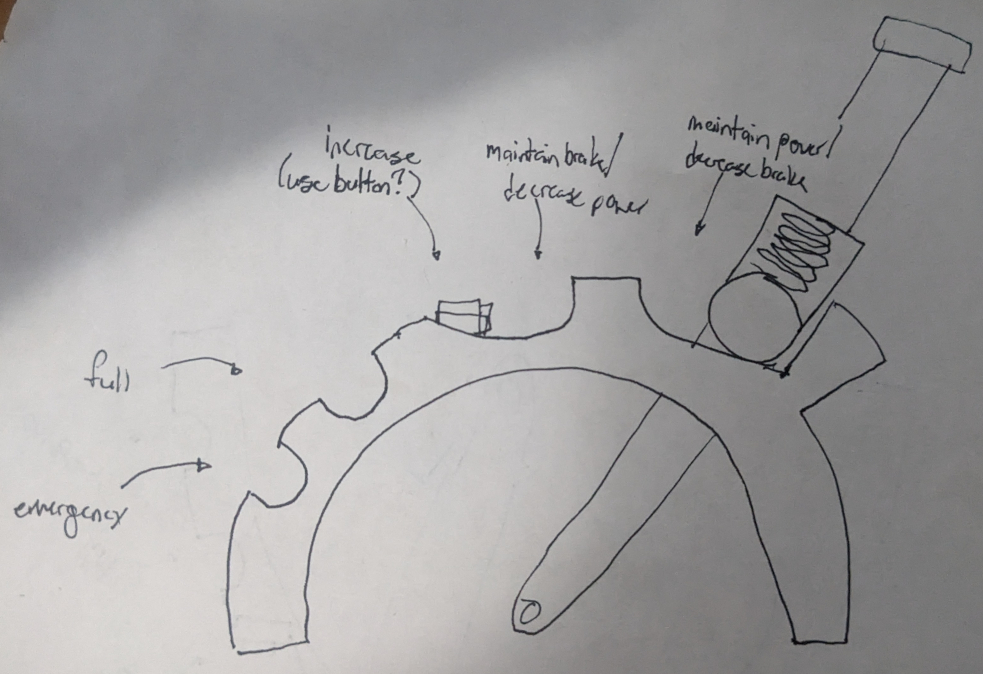

# Simrigs for Simrail
Train simulators, like many simulators, often implement a mouse and keyboard, or click and drag UI. While this is sufficient for most players, some avid users take to a more unconventional approach: [building their own controllers](https://forum.simrail.eu/topic/6526-simrail-controller-hardware-weve-built/). These controllers range from simple levers to entire train desks, sometimes even going as far to use actual components from the train they are emulating. In this file, I document in a train of thought style my approach to creating my own SimRig(s), specifically for the Polish trains used in the game "Simrail." At time of writing, I plan to make a rig for the [EN96](https://simrail.fandom.com/wiki/Trains#EN96_%22Elf%22_EMU) passenger loco, with plans to include either the [E 186 "Traxx"](https://simrail.fandom.com/wiki/Trains#E_186_(BR_186)_%22Traxx%22_locomotive) or more likely the [EU07](https://simrail.fandom.com/wiki/Trains#EU07_%22Si%C3%B3demka%22_locomotive) cargo loco at a later date.

## The Basics
With the project introduction out of the way, it's time to list some high level requirements that *every* simrig needs. Namely:

- Control unit (Arduino, RPi, etc.)
- I/O to the game (how to send/receive status updates?)
- Physical controls (buttons, switches, potentiometors, etc.)
- Interfaces to the physical controls (switch covers, levers, etc.)
- Physical structure (how does the whole thing go together)

Pitek's example above, as well as Gazz292's [forum post](https://forum.simrail.eu/topic/6526-simrail-controller-hardware-weve-built/) that it came from show all these parts in various implementaions. They use techniques ranging from hacking into macro keyboards to running custom software on microcontrollers. That said, there's a caveat when designing a simrig for Simrail: The game currently has no custom controller I/O (e.g. RailDriver). Therefore, all of these solutions attempt to hack in some sort of keyboard inputs, typically using the [JoytoKey software](https://joytokey.net/en/).

This lead me to think that there could be an easy way. A way to program the microcontroller to send the keyboard inputs direcly, similar to Gazz's simple solution for the horn. of soldering to an existing USB device. To the uninitiated, I therefore introduce the Human Interface Device (HID)! This is a generic device, usually over USB, used to interface to a computer. In fact, all keyboards are HID devices, with their own little controllers. With [some quick Google-Fu](https://electronics.stackexchange.com/questions/48357/easiest-way-to-create-a-usb-hid-device), I found out that it should be [trivially easy](https://hackaday.com/2012/06/29/turning-an-arduino-into-a-usb-keyboard/) to set up an Arduino as an HID keyboard, therefore letting me send as many arbitrary keystrokes as I want.

As for what specific board I want to use, I'll need to specify that later. The real thing costs US$25-$30 on [Arduino's website](https://store-usa.arduino.cc/products/arduino-leonardo-with-headers?selectedStore=us), and I sure don't want to know what they'll cost to ship to Canada, but Cheap knockoff [Uno R3](https://www.aliexpress.com/item/32758607490.html?algo_pvid=09fbdea3-1e1d-4822-9671-a7e04f768322&utparam-url=scene%3Asearch%7Cquery_from%3A) and [Leonardo](https://www.aliexpress.com/item/1005005970469916.html?algo_pvid=46a7b7c5-3f19-4343-9f54-52fb1e0e7ae7&utparam-url=scene%3Asearch%7Cquery_from%3A) boards can be bought off AliExpress (which is my go-to for these hobby projects) for less than 10 Canadian Pesos, so I'll probably use one of those.

This solves the problems of what control unit to use, and how to send information to the game, so there's a few more things to get out of the way. The game has no outputs, so I'll have to scrape what I can from the API, which exists but has [no documentation](https://forum.simrail.eu/topic/3190-api-endpoints/), and simply work around the rest. Honestly, I can live without it, but I plan to have some sort of a button to "reset the train" to a known state. The physical interfaces will be buttons, switches, and potentiometors depending on the function, but for cost reasons I will probably work with whatever switches are cheapest and 3D printed covers (since e.g. the cheapest selector I could find close to what the EN22 simrig above uses was [$23 on Digikey](https://www.digikey.ca/en/products/detail/omron-automation-and-safety/A22NS-2BM-NBA-G100-NN/6203737)).

Finally, the physical parts that hold everything together are... Well, at the bottom of my todo list. While Pitek's EU07 simrig is cool, I simply don't have the space for something like that. One beauty of the EN22 is that it should be possible to break it up into two, maybe three seperate panels that can fit onto a desk but also be easily removed and put into storage. Eventually I may integrate these into a full operator's desk, on castor wheels, but that is far in the future.

## The Not So Basics
In this section, I'll go through the nitty-gritty of how I plan to do things. Or, more accurately, this is a dumping ground for links to tutorials. But of course, to find these tutorials, I also need to know what it is I need to do! So, here we go! I include here a picture of the cab for reference, since that's what I'll base my initial component selection on.

1. [Program the Arduino as an HID device](#1-arduino-leonardo-as-an-hid-device)
2. [Design Analog Connections (i.e. Levers)](#2-analog-connections)

### 1. Arduino Leonardo as an HID Device

Section summary:
- [Leonardo as Keyboard Video](https://www.youtube.com/watch?v=yTc2GLXfCOY)
- [Arduino IDE in VSCode](https://www.luisllamas.es/en/arduino-visual-studio-code/)
- [Fake Arduino Leonardos on Ali](https://www.aliexpress.com/item/1005005970469916.html)

[This video](https://www.youtube.com/watch?v=yTc2GLXfCOY) succinctly goes over the details of setting things up using the Arduino IDE. I normally don't like videos, but everything else I can find is a decade old or really poorly written (or both). Also, I might need to figure out [a way to set this up using VSCode](https://www.luisllamas.es/en/arduino-visual-studio-code/), since that's what I'm familiar with.

As a reminder, I plan to use a knockoff Arduino Leonardo from AliExpress. I've bought from [Tenstar](https://www.aliexpress.com/item/1005005970469916.html) in the past so that's likely who I'll go with. But there are [plenty of other sellers](https://www.aliexpress.com/item/1005005970469916.html) in the marketplace (or you could buy a fake off Amazon).

### 2. Analog Connections (i.e. Levers)
Section Summary
- [Gear Generator](https://evolventdesign.com/pages/spur-gear-generator)
- [X-plane simrig, has many suggestions applicable to my design](https://realsimcontrol.com/io_msw.html)

The analog connections are required to determine the position of a lever. This is useful for train throttles, brakes, and anything else that isn't (effectively) a switch. I could also use rotary potentiometors and some mechanical cheating to mimic the behavior of those $23 rotary switches I mentioned earlier.

A cheap rotary pot is $3 on DigiKey, not including shipping, so I again will pick [AliExpress](https://www.aliexpress.com/w/wholesale-potentiometor.html). A single potentiometor costs around $1 there after shipping, or you can get a pack of 10 for under $5 (with free shipping on orders over $10). [3 position](https://www.aliexpress.com/w/wholesale-rotary-switch-3-position.html) and [4 position](https://www.aliexpress.com/w/wholesale-rotary-switch-4-position.html) rotary switches are around $3 each, [toggle switches](https://www.aliexpress.com/w/wholesale-toggle-switch.html) are $4 for 10, and [momentary switches](https://www.aliexpress.com/w/wholesale-momentary-switch.html) (AKA buttons) come in bags of 100 at the cheapest (though I would buy the [threaded ones](https://www.aliexpress.com/item/32804945328.html)). [LED buttons](https://www.aliexpress.com/w/wholesale-led-button.html) are also an alternative, since I see some of those on the dash.

...And I could go on. I won't sort all those links since honestly, they can be found by searching for what you want on AliExpress. But hopefully it shows that component sourcing *won't* be a problem. What is a problem, however, is figuring out how to actuall make the damn things move. Let's start with the rotary pot: Yeah it's good and all to just have one, and wiring to the Arduino will be brain dead easy (I could make a resistive divider into an analog pin in my sleep), but how exactly do we couple it to a lever? I'll take a page out of Gazz's book, and use gears. I'll be using 3D printing for all my manufacturing, which means I need some way of designing these gears in CAD. While I could use solidworks, I actually know about a cool [gear generator](https://evolventdesign.com/pages/spur-gear-generator) that does exactly what I need. By applying a 2:1 gear ratio, I can turn what I'm assuming are around 60 degree rotations of the power and brake levers into around 120 degrees of potentiometor rotation. It's not perfect, but I can tweak things if I want more dynamic range (and once I know the full rotations of the handles an potentiometors). This also means I'll need to consider mounting, but Gazz already shows the basics in their thread (and repeated in the image below).

Now, the above image also shows Gazz's solution for the number of "positions" each lever has. You know, when you push a lever and it "snaps" to a position (e.g. a light switch is a lever with two positions). The industry term for this is "detents," and I'll need a plan for making those. I'll take a page out of the book of an [X-plane tutorial](https://realsimcontrol.com/io_msw.html) (which, by the way, is a great outline of some various ways I could make the controls for my own Simrig), and make a simple spring latching system based on the flaps lever (though obviously I won't be using momentary push buttons, as entertaining as that would be). Gazz's system (shown above) uses the red levers with a tension spring, but I think I can get away with a [ball plunger](https://www.aliexpress.com/w/wholesale-ball-plunger.html) to latch my detents.

To get any more specific, I'll need to look at the specific train I am designing for. Some, like the EU07 with its 48 position power wheel are simple, but EN96's combined brake/throttle is more difficult: Rather than having specific detents, some positions are "momentary" (that is, the throttle will not stay in that position). As shown in the GIF below, the levers need to lock into certain positions, but not other ones. To do this, we need to make sure to make the semicircles for those positions are egg-shaped, with the wide end of the egg causing the throttle to fall back into the position we want...

But there's a wrench in the works here too: While we can put stoppers on the "increase throttle" and "decrease brake" of the two levers, thus giving a satisfying stopping point, we can't do that to the "increase brake force" position. But without physical feedback to the user, it's going to be way too easy to accidentally throw the power lever into the full braking position. At the moment, I can only think of Rube Goldberg solutions to this problem, such as embedding momentary buttons into the semicircles.

Overall, then, my design on a napkin is as follows:

 

### 3. Digital Connections (i.e. buttons and switches)