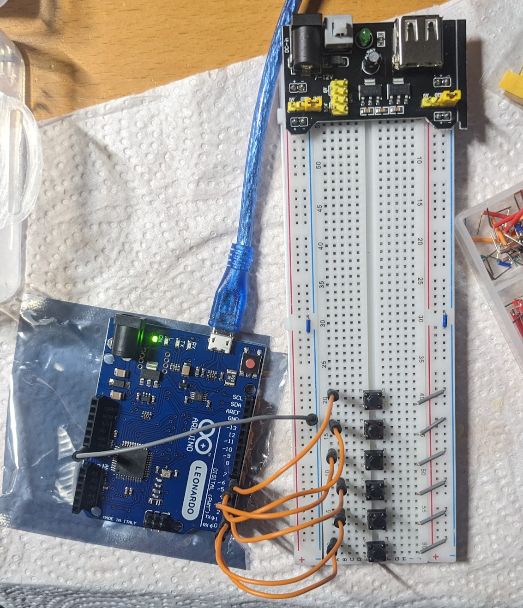

# Simrigs for Truck Sim
Simrigs for Euro Truck and American Truck simulator (referred to generically as "Truck Sim") are significanly less complex than for train simulators, in no small part thanks to the commercial availability of simrigs for such a purpose (and adjacent purposes like racing). Crucially, the main control systems of a wheel, pedals, and shifters are already commercially available, and thus "simrig" in this context generally refers to the physical frame and connected peripherals rather than requiring an entire control panel to be designed from scratch.

This makes a simrig for Truck Sim a significantly easier project to take through to completion, as rather than designing control systems, generally only a button panel is required. The physical frame of the simrig can also take some consideration, should a commercial variant not be on the cards.

## The Basics

A basic simrig for trucking (or racing or bussing) typically consists of a few basic parts:
1. Wheel (and pedals and shifter)
1. Physical Frame
1. Button panel(s)
1. Sim Dashboard (optional)

For an initial design, I am bringing my existing Thrustmaster T300 wheel, so all that is needed is a frame and button panel. Sim dashboard is a nice addon, but not strictly necessary (as it only repeats information available in-game), requires an Android tablet, and appears to be Windows only for integration with Truck Sim.

### Physical Frame

Numerous extruded aluminum frames are available, from various manufacturers. Alternatively, a wooden frame can be made, as described by [SimAddict](https://www.simaddict.net/sim-racing-guides/how-to-build-a-sim-rig-with-wood). Seat considerations include buying a pickup truck seat from a local junkyard, according to [Reddit](https://www.reddit.com/r/trucksim/comments/yqmvq3/looking_for_seat_tips_for_my_sim_rig_so_i_can/), or buying forklift seats on Amazon, like [Linus Tech Tips' video](https://www.youtube.com/watch?v=cgfx2mLSI-A).

### Button Panel

Button panel can be made to various levels of realism. TODO: Add screenshots of trucks to be used. Keyed ignition may require some additional logic, though since we are using an Arduino we may be able to bypass the editing of `controls.sii` that [George on the SCS forums](https://forum.scssoft.com/viewtopic.php?t=311011) suggests. The main reason for starting with a truck Simrig is also here: I can easily mock up a button panel on a breadboard using one of the many Arduino kits available on AliExpress.

Later iterations will use the same ["monolever joysticks"](https://www.aliexpress.com/w/wholesale-joystick-toggle-switch.html) as I plan to use in the SimRail rig, while the master key can use something like a [3 position keyed selector](https://www.aliexpress.com/item/1005005578633896.html). 

### Additional Resources

Technically this is going to be more of a look into various "sim dashboards" since I ended up exploring that. 

Sim dashboards are, practically speaking, what they say on the tin. A virtual diplay of a dashboard--speedometors, tachometers, etc. but often also providing support for virtual button panels. My use case is primarily the various gauges though, since I can find those difficult to see in game on certain trucks.

In my search I've found three implementations of a sim dashboard:

There is of course stryder-it's [Sim Dashboard](https://www.stryder-it.de/simdashboard/ets2_ats) which as mentioned requires running a Windows-based server (DLL injector?) on the same machine as the game to transmit data to an Android tablet. This potentially could be used on Linux as well, since in theory it is possible to install the Sim Dashboard server to the correct WINE environment, but frankly not worth the effort. Sim Dashboard is completely free, as far as I can tell.

Next is Pyrofrog Studio's [Dashpanel](https://www.pyrofrogstudios.com/dashpanel.html). It, too, requires a server to be run locally, which is available on Steam. On paper, it is the same as Sim Dashboard, but with one key difference: Dashpanel requires purchases of DLC on Steam to unlock its full functionality; for Truck Simulator this is a CA$4.99 purchase. I am not sure why anyone would buy this over Sim Dashboard to be honest.

The final product I have found is [SimHub](https://www.simhubdash.com/). Simhub expands on the offerings by not only providing the expected virtual dashboard and button panels, but various feedback and motion systems as well. Critically, if shakers are desired, Simhub will be all but required, as it is the only one of these that supports a motion system, thus reducing the number of "overhead software" running. Like the previous two offerings, the server software appears to be Windows only. SimHub has a free offering, but fullly-featured requires a "choose your price" license costing at minimum €6.99.

## The Specifics

I will be basing the available controls on [this Steam guide by lapidary.master](https://steamcommunity.com/sharedfiles/filedetails/?id=2378657608), though obviously updating it to the 2024 control scheme by verifying manually in-game. Therefore, we have the following list of possible (and default) bindings:

```
Truck Controls
| Function                            |   Primary   |  Secondary  |
| ----------------------------------- | ----------- | ----------- |
| Throttle                            |  Up   Arrow |      W      |
| Brake / Reverse                     | Down  Arrow |      S      |
| Steering Left                       | Left  Arrow |      A      |
| Steering Right                      | Right Arrow |      D      |
| Shift Up                            | Left  Shift | Right Shift |
| Shift Down                          | Left  Ctrl  | Right  Ctrl |
| Shift to Neutral                    |     N/A     |     N/A     |
| Shift Up Hint                       |     N/A     |     N/A     |
| Shift Down Hint                     |     N/A     |     N/A     |
| Gearbox Switch Automatic/Sequential |     N/A     |     N/A     |
| Start/Stop Engine                   |      E      |     N/A     |
| Start/Stop Engine Electricity       |     N/A     |     N/A     |
| Parking Brake                       |    Space    |     N/A     |
| Engine Brake                        |      B      |     N/A     |
| Engine Brake Toggle                 |     N/A     |     N/A     |
| Engine Brake Increase               |     N/A     |     N/A     |
| Engine Brake Decrease               |     N/A     |     N/A     |
| Trailer Brake                       |     N/A     |     N/A     |
| Retarder Increase                   |      ;      |     N/A     |
| Retarder Decrease                   |      '      |     N/A     |
| Lift/Drop Axle                      |      U      |     N/A     |
| Lift/Drop Trailer Axle              |     N/A     |     N/A     |
| Differential Lock                   |      V      |     N/A     |
| Front Suspension Up                 |     N/A     |     N/A     |
| Front Suspension Down               |     N/A     |     N/A     |
| Rear Suspension Up                  |     N/A     |     N/A     |
| Rear Suspension Down                |     N/A     |     N/A     |
| Suspension Reset                    |     N/A     |     N/A     |
| Left-Turn Indicator                 |      [      |     N/A     |
| Right-Turn Indicator                |      ]      |     N/A     |
| Hazard Warning                      |      F      |     N/A     |
| Light Modes                         |      L      |     N/A     |
| High Beam Headlights                |      K      |     N/A     |
| Beacon                              |      O      |     N/A     |
| Horn                                |      H      |     N/A     |
| Air Horn                            |      N      |     N/A     |
| Light Horn                          |      J      |     N/A     |
| Wipers                              |      P      |     N/A     |
| Wipers Back                         |     N/A     |     N/A     |
| Cruise Control                      |      C      |     N/A     |
| Cruise Control Speed Increase       |     N/A     |     N/A     |
| Cruise Control Speed Decrease       |     N/A     |     N/A     |
| Cruise Control Resume               |     N/A     |     N/A     |
| Adaptive Cruise Control Mode        |     N/A     |     N/A     |
| Emergency Brake                     |     N/A     |     N/A     |
| Lane Keeping Assistant              |     N/A     |     N/A     |
| Lane Assist Mode                    |     N/A     |     N/A     |
| Dashboard Display Mode              |      I      |     N/A     |
| Infotainment Display Mode           |     N/A     |     N/A     |
| Navigation Zoom Mode                |     N/A     |     N/A     |
| Trip Info Reset                     |     N/A     |     N/A     |
| Open Right Window                   |     N/A     |     N/A     |
| Close Right Window                  |     N/A     |     N/A     |
| Open Left Window                    |     N/A     |     N/A     |
| Close Left Window                   |     N/A     |     N/A     |
```

Annoyingly, this does show that even in 2024 we'll have to apply George's manual controls.sii edits so that the key of the rig works properly, since `ignitionoff` and the other related settings do not have an in-game GUI. [George's button box](https://forum.scssoft.com/viewtopic.php?p=1697950) also seems like a good place to draw inspiration from, as they describe more edits you can do to the `controls.sii` to get the behaviors you want. The major difference is I will be leveraging the Arduino Leonardo's keyboard library, rather than encoding as controller inputs.

Regardless, I can worry about that later, since to start I'll be working off a breadboard, and I already have the engine bound to the "options" button of my T300. I also use automatic retarder and engine brake, and while I plan to learn realistic air simulation at some point... Well, I actually can't figure out the most realistic retarder and engine brake settings. Best I can find is a [Reddit discussion](https://www.reddit.com/r/trucksim/comments/17be9n0/realistic_use_of_engine_brake_and_retarder/) from which I conclude I'll need a retarder lever on the rig at some point. Lots of other settings are likewise on auto or already bound. Long story short, then, my candidates for this breadboarded button panel are:
- Retarder Increase
- Retarder Decrease
- Differential Lock
- Front Suspension Up
- Front Suspension Down
- Rear Suspension Up
- Rear Suspension Down
- Suspension Reset
- Dashboard Display Mode
- Infotainment Display Mode
- Trip Info Reset
- Open Left Window
- Close Left Window

This list covers basically every control I feel is "missing" from my current setup. YMMV. I also honestly could play without a lot of these (like suspension height adjust), or rather, already do play without using most of these. I think the only one I've used is the differential lock, and I just press the keyboard button... Frankly I get the feeling I should work on the frame of the rig first, then add all the buttons and dials into a "cockpit" to make sitting in it feel realistic, but I digress.

Something I really feel is missing most is the dashboard/infotainment controls. I've always been annoyed by certain default settings, but in my stupor never bothered to push the damn `I` key while I still remember it changed the dash settings. So I think I'll start with those, and the window controls for good measure. That is, this initial design will include buttons for:
- Dashboard Display Mode (`I`)
- Infotainment Display Mode
- Trip Info Reset
- Open Left Window
- Close Left Window

While the first of these has a default binding, I need to come up with bindings and combinations for the rest. I also need to make sure these are unique, so there are no overlapping bindings. Thus, I must create a spreadsheet containing all the bindings, and in the interest of FOSS principles it must be stored here in the repo. I am really looking forward to this...

That said, I'll ignore that problem for now in favor of getting my Leonardo up and running. I work my way through the [Blinky](https://docs.arduino.cc/built-in-examples/basics/Blink/) and [InputPullupSerial](https://docs.arduino.cc/built-in-examples/digital/InputPullupSerial/) examples to refresh myself, then dive straight into getting all six buttons working. For debouncing, I am using the [Debounce](https://reference.arduino.cc/reference/en/libraries/debounce/) library by kimballa, so I started with [their example code](https://github.com/kimballa/button-debounce/blob/main/examples/buttons/buttons.ino) using a single button. It was trivially easy to extend that to all six buttons I initially wired, though I did need to do some trickery with casting to an Arduino `String` to get the printing right. You can see this code from [3550f94](https://github.com/Tropingenie/SimRigs/commit/3550f94cf8c2f66ea65368e18eceb71487b3fba4) onward. Below is a photo of the electrical setup; a schematic will not be provided since it is just the circuit from [InputPullupSerial](https://docs.arduino.cc/built-in-examples/digital/InputPullupSerial/) six times (if you have trouble with figuring out internally pulled-up low-true buttons, have I got news for you...). The *one* tricky thing is figuring out which terminals connect to which poles, which is why the keen eyed among you will notice I've connected the buttons "diagonally." A neat trick I learned after setting this up is to think of the button as "two staples," which really helps figure out which two terminals are internally connected, but that isn't a problem on the breadboard.



From here, it's a simple matter to put in a switch-case statement based on `btnId` and send the keystrokes accordingly using [Keyboard](https://www.arduino.cc/reference/en/language/functions/usb/keyboard/). For button 1, I decided to send `i` so I can use that as my infotainment button, while the others will be for controls that have no default binding. Initially, I sent the `ctrl` key followed by an arbitrary letter, but as it turns out ETS (and so I assume ATS as well) doesn't accept modifier keys. Through trial and error, I settled on sending the keys `,./` and the one that shares `~`(Markdown nerds know why I have to say it that way). I'll probably switch to the [(non-name brand) Joystick library](https://github.com/MHeironimus/ArduinoJoystickLibrary/) instead, based on [this tutorial](https://www.instructables.com/Arduino-LeonardoMicro-as-Game-ControllerJoystick/).