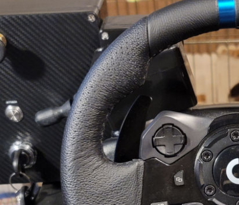
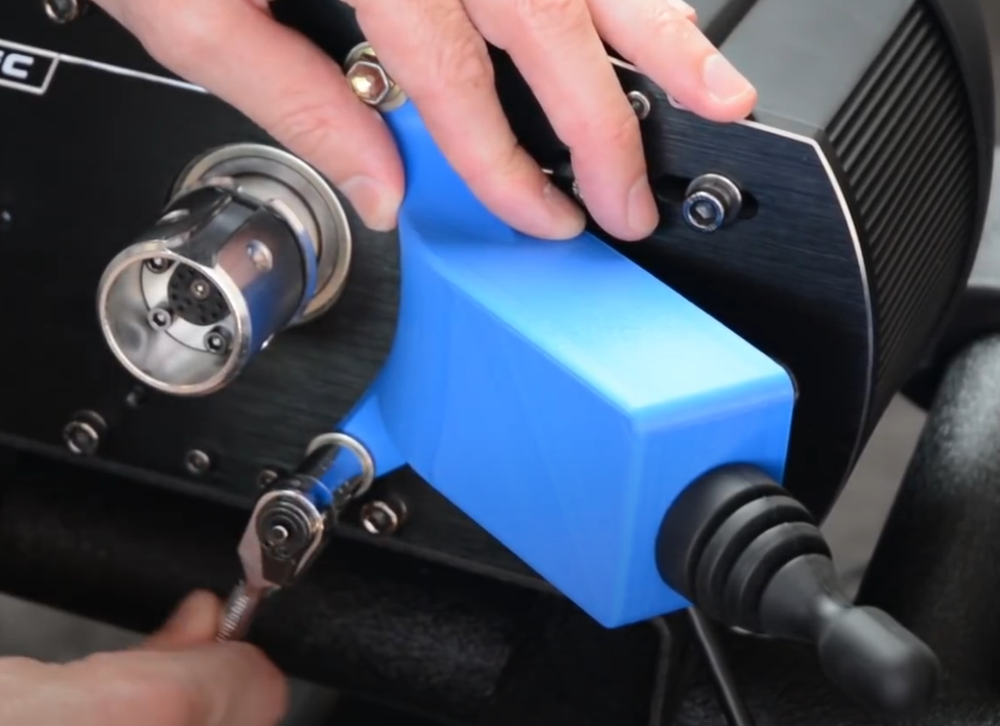
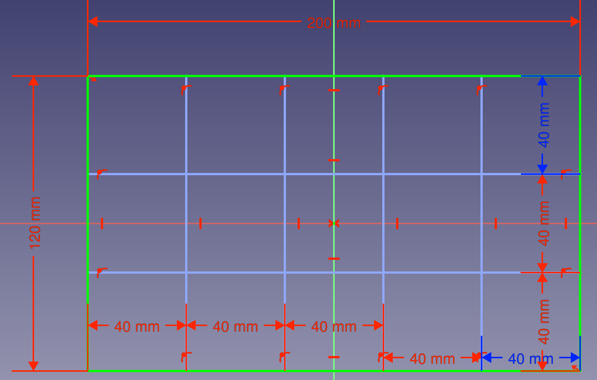
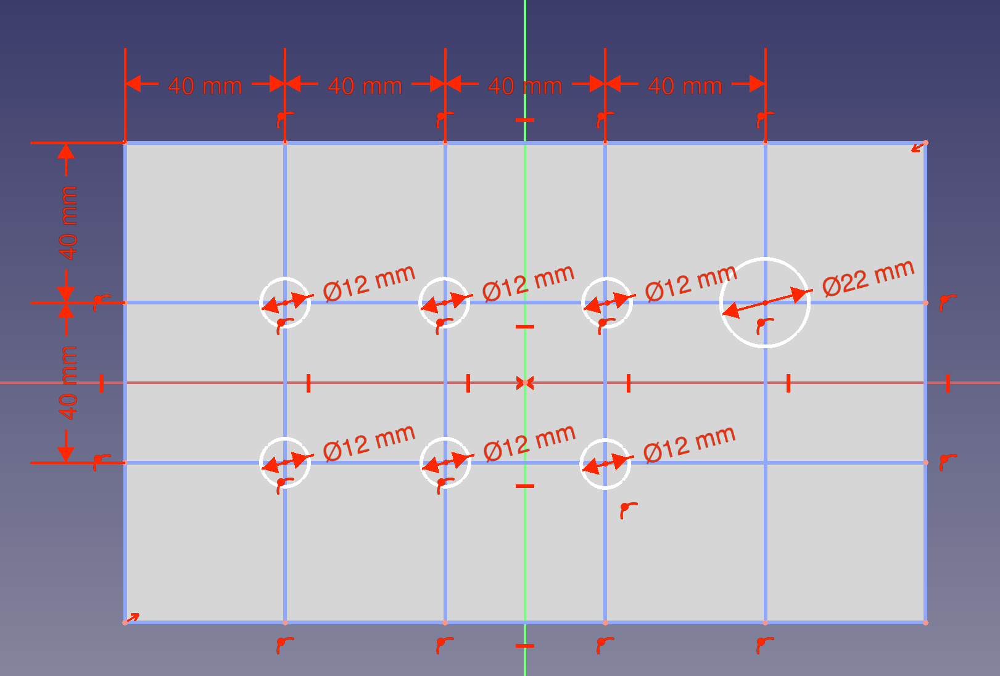
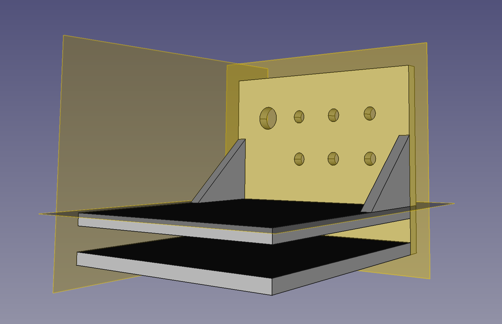

# Simrigs for Truck Sim
Simrigs for Euro Truck and American Truck simulator (referred to generically as "Truck Sim") are significanly less complex than for train simulators, in no small part thanks to the commercial availability of simrigs for such a purpose (and adjacent purposes like racing). Crucially, the main control systems of a wheel, pedals, and shifters are already commercially available, and thus "simrig" in this context generally refers to the physical frame and connected peripherals rather than requiring an entire control panel to be designed from scratch.

This makes a simrig for Truck Sim a significantly easier project to take through to completion, as rather than designing control systems, generally only a button panel is required. The physical frame of the simrig can also take some consideration, should a commercial variant not be on the cards.

## The Basics

A basic simrig for trucking (or racing or bussing) typically consists of a few basic parts:
1. Wheel (and pedals and shifter)
1. Physical Frame
1. Button panel(s)
1. Sim Dashboard (optional)

For an initial design, I am bringing my existing Thrustmaster T300 wheel, so all that is needed is a frame and button panel. Sim dashboard is a nice addon, but not strictly necessary (as it only repeats information available in-game), requires an Android tablet, and appears to be Windows only for integration with Truck Sim.

### Physical Frame

Numerous extruded aluminum frames are available, from various manufacturers. Alternatively, a wooden frame can be made, as described by [SimAddict](https://www.simaddict.net/sim-racing-guides/how-to-build-a-sim-rig-with-wood). Seat considerations include buying a pickup truck seat from a local junkyard, according to [Reddit](https://www.reddit.com/r/trucksim/comments/yqmvq3/looking_for_seat_tips_for_my_sim_rig_so_i_can/), or buying forklift seats on Amazon, like [Linus Tech Tips' video](https://www.youtube.com/watch?v=cgfx2mLSI-A).

### Button Panel

Button panel can be made to various levels of realism. TODO: Add screenshots of trucks to be used. Keyed ignition may require some additional logic, though since we are using an Arduino we may be able to bypass the editing of `controls.sii` that [George on the SCS forums](https://forum.scssoft.com/viewtopic.php?t=311011) suggests. The main reason for starting with a truck Simrig is also here: I can easily mock up a button panel on a breadboard using one of the many Arduino kits available on AliExpress.

Later iterations will use the same ["monolever joysticks"](https://www.aliexpress.com/w/wholesale-joystick-toggle-switch.html) as I plan to use in the SimRail rig, while the master key can use something like a [3 position keyed selector](https://www.aliexpress.com/item/1005005578633896.html). 

### Additional Resources

Technically this is going to be more of a look into various "sim dashboards" since I ended up exploring that. 

Sim dashboards are, practically speaking, what they say on the tin. A virtual diplay of a dashboard--speedometors, tachometers, etc. but often also providing support for virtual button panels. My use case is primarily the various gauges though, since I can find those difficult to see in game on certain trucks.

In my search I've found three implementations of a sim dashboard:

There is of course stryder-it's [Sim Dashboard](https://www.stryder-it.de/simdashboard/ets2_ats) which as mentioned requires running a Windows-based server (DLL injector?) on the same machine as the game to transmit data to an Android tablet. This potentially could be used on Linux as well, since in theory it is possible to install the Sim Dashboard server to the correct WINE environment, but frankly not worth the effort. Sim Dashboard is completely free, as far as I can tell.

Next is Pyrofrog Studio's [Dashpanel](https://www.pyrofrogstudios.com/dashpanel.html). It, too, requires a server to be run locally, which is available on Steam. On paper, it is the same as Sim Dashboard, but with one key difference: Dashpanel requires purchases of DLC on Steam to unlock its full functionality; for Truck Simulator this is a CA$4.99 purchase. I am not sure why anyone would buy this over Sim Dashboard to be honest.

The final product I have found is [SimHub](https://www.simhubdash.com/). Simhub expands on the offerings by not only providing the expected virtual dashboard and button panels, but various feedback and motion systems as well. Critically, if shakers are desired, Simhub will be all but required, as it is the only one of these that supports a motion system, thus reducing the number of "overhead software" running. Like the previous two offerings, the server software appears to be Windows only. SimHub has a free offering, but fullly-featured requires a "choose your price" license costing at minimum €6.99.

## The Specifics

## The Code

I will be basing the available controls on [this Steam guide by lapidary.master](https://steamcommunity.com/sharedfiles/filedetails/?id=2378657608), though obviously updating it to the 2024 control scheme by verifying manually in-game. Therefore, we have the following list of possible (and default) bindings:

```
Truck Controls
| Function                            |   Primary   |  Secondary  |
| ----------------------------------- | ----------- | ----------- |
| Throttle                            |  Up   Arrow |      W      |
| Brake / Reverse                     | Down  Arrow |      S      |
| Steering Left                       | Left  Arrow |      A      |
| Steering Right                      | Right Arrow |      D      |
| Shift Up                            | Left  Shift | Right Shift |
| Shift Down                          | Left  Ctrl  | Right  Ctrl |
| Shift to Neutral                    |     N/A     |     N/A     |
| Shift Up Hint                       |     N/A     |     N/A     |
| Shift Down Hint                     |     N/A     |     N/A     |
| Gearbox Switch Automatic/Sequential |     N/A     |     N/A     |
| Start/Stop Engine                   |      E      |     N/A     |
| Start/Stop Engine Electricity       |     N/A     |     N/A     |
| Parking Brake                       |    Space    |     N/A     |
| Engine Brake                        |      B      |     N/A     |
| Engine Brake Toggle                 |     N/A     |     N/A     |
| Engine Brake Increase               |     N/A     |     N/A     |
| Engine Brake Decrease               |     N/A     |     N/A     |
| Trailer Brake                       |     N/A     |     N/A     |
| Retarder Increase                   |      ;      |     N/A     |
| Retarder Decrease                   |      '      |     N/A     |
| Lift/Drop Axle                      |      U      |     N/A     |
| Lift/Drop Trailer Axle              |     N/A     |     N/A     |
| Differential Lock                   |      V      |     N/A     |
| Front Suspension Up                 |     N/A     |     N/A     |
| Front Suspension Down               |     N/A     |     N/A     |
| Rear Suspension Up                  |     N/A     |     N/A     |
| Rear Suspension Down                |     N/A     |     N/A     |
| Suspension Reset                    |     N/A     |     N/A     |
| Left-Turn Indicator                 |      [      |     N/A     |
| Right-Turn Indicator                |      ]      |     N/A     |
| Hazard Warning                      |      F      |     N/A     |
| Light Modes                         |      L      |     N/A     |
| High Beam Headlights                |      K      |     N/A     |
| Beacon                              |      O      |     N/A     |
| Horn                                |      H      |     N/A     |
| Air Horn                            |      N      |     N/A     |
| Light Horn                          |      J      |     N/A     |
| Wipers                              |      P      |     N/A     |
| Wipers Back                         |     N/A     |     N/A     |
| Cruise Control                      |      C      |     N/A     |
| Cruise Control Speed Increase       |     N/A     |     N/A     |
| Cruise Control Speed Decrease       |     N/A     |     N/A     |
| Cruise Control Resume               |     N/A     |     N/A     |
| Adaptive Cruise Control Mode        |     N/A     |     N/A     |
| Emergency Brake                     |     N/A     |     N/A     |
| Lane Keeping Assistant              |     N/A     |     N/A     |
| Lane Assist Mode                    |     N/A     |     N/A     |
| Dashboard Display Mode              |      I      |     N/A     |
| Infotainment Display Mode           |     N/A     |     N/A     |
| Navigation Zoom Mode                |     N/A     |     N/A     |
| Trip Info Reset                     |     N/A     |     N/A     |
| Open Right Window                   |     N/A     |     N/A     |
| Close Right Window                  |     N/A     |     N/A     |
| Open Left Window                    |     N/A     |     N/A     |
| Close Left Window                   |     N/A     |     N/A     |
```

Annoyingly, this does show that even in 2024 we'll have to apply George's manual controls.sii edits so that the key of the rig works properly, since `ignitionoff` and the other related settings do not have an in-game GUI. [George's button box](https://forum.scssoft.com/viewtopic.php?p=1697950) also seems like a good place to draw inspiration from, as they describe more edits you can do to the `controls.sii` to get the behaviors you want. The major difference is I will be leveraging the Arduino Leonardo's keyboard library, rather than encoding as controller inputs.

Regardless, I can worry about that later, since to start I'll be working off a breadboard, and I already have the engine bound to the "options" button of my T300. I also use automatic retarder and engine brake, and while I plan to learn realistic air simulation at some point... Well, I actually can't figure out the most realistic retarder and engine brake settings. Best I can find is a [Reddit discussion](https://www.reddit.com/r/trucksim/comments/17be9n0/realistic_use_of_engine_brake_and_retarder/) from which I conclude I'll need a retarder lever on the rig at some point. Lots of other settings are likewise on auto or already bound. Long story short, then, my candidates for this breadboarded button panel are:
- Retarder Increase
- Retarder Decrease
- Differential Lock
- Front Suspension Up
- Front Suspension Down
- Rear Suspension Up
- Rear Suspension Down
- Suspension Reset
- Dashboard Display Mode
- Infotainment Display Mode
- Trip Info Reset
- Open Left Window
- Close Left Window

This list covers basically every control I feel is "missing" from my current setup. YMMV. I also honestly could play without a lot of these (like suspension height adjust), or rather, already do play without using most of these. I think the only one I've used is the differential lock, and I just press the keyboard button... Frankly I get the feeling I should work on the frame of the rig first, then add all the buttons and dials into a "cockpit" to make sitting in it feel realistic, but I digress.

Something I really feel is missing most is the dashboard/infotainment controls. I've always been annoyed by certain default settings, but in my stupor never bothered to push the damn `I` key while I still remember it changed the dash settings. So I think I'll start with those, and the window controls for good measure. That is, this initial design will include buttons for:
- Dashboard Display Mode (`I`)
- Navigation Zoom Mode
- Trip Info Reset
- Open Left Window
- Close Left Window

While the first of these has a default binding, I need to come up with bindings and combinations for the rest. I also need to make sure these are unique, so there are no overlapping bindings. Thus, I must create a spreadsheet containing all the bindings, and in the interest of FOSS principles it must be stored here in the repo. I am really looking forward to this...

That said, I'll ignore that problem for now in favor of getting my Leonardo up and running. I work my way through the [Blinky](https://docs.arduino.cc/built-in-examples/basics/Blink/) and [InputPullupSerial](https://docs.arduino.cc/built-in-examples/digital/InputPullupSerial/) examples to refresh myself, then dive straight into getting all six buttons working. For debouncing, I am using the [Debounce](https://reference.arduino.cc/reference/en/libraries/debounce/) library by kimballa, so I started with [their example code](https://github.com/kimballa/button-debounce/blob/main/examples/buttons/buttons.ino) using a single button. It was trivially easy to extend that to all six buttons I initially wired, though I did need to do some trickery with casting to an Arduino `String` to get the printing right. You can see this code from [3550f94](https://github.com/Tropingenie/SimRigs/commit/3550f94cf8c2f66ea65368e18eceb71487b3fba4) onward. Below is a photo of the electrical setup; a schematic will not be provided since it is just the circuit from [InputPullupSerial](https://docs.arduino.cc/built-in-examples/digital/InputPullupSerial/) six times (if you have trouble with figuring out internally pulled-up low-true buttons, have I got news for you...). The *one* tricky thing is figuring out which terminals connect to which poles, which is why the keen eyed among you will notice I've connected the buttons "diagonally." A neat trick I learned after setting this up is to think of the button as "two staples," which really helps figure out which two terminals are internally connected, but that isn't a problem on the breadboard.


From here, it's a simple matter to put in a switch-case statement based on `btnId` and send the keystrokes accordingly using [Keyboard](https://www.arduino.cc/reference/en/language/functions/usb/keyboard/). For button 1, I decided to send `i` so I can use that as my infotainment button, while the others will be for controls that have no default binding. Initially, I sent the `ctrl` key followed by an arbitrary letter, but as it turns out ETS (and so I assume ATS as well) doesn't accept modifier keys. Through trial and error, I settled on sending the keys `,./` and the one that shares `~`(Markdown nerds know why I have to say it that way). I'll probably switch to the [(non-name brand) Joystick library](https://github.com/MHeironimus/ArduinoJoystickLibrary/) instead, based on [this tutorial](https://www.instructables.com/Arduino-LeonardoMicro-as-Game-ControllerJoystick/).

My final bindings looked as follows:


However, this still highlighted another issue: My windows were done wrong, as I had mistakenly assumed they were toggles. Still, it wasn't a hard change to make since Keyboard supports "hitting" and "releasing" keys seperately.

Moving on, I wanted to use a Joystick library to circumvent the 'keystroke' limitations, since as far as I am aware ETS should handle seperate "game controllers" better than it does keyboards. As mentioned earlier, I'll be using [ArduinoJoystick by MHeironimus](https://github.com/MHeironimus/ArduinoJoystickLibrary/) to do so, which comes with the caveat that the library *isn't* available right through the Arduino IDE. Furthermore, since the Arduino IDE has its own build steps, it doesn't allow me to just `#include` straight from the submodule. Long story short, if you're following along make sure to add the `ArduinoJoystick.zip` file as a library in the Arduino IDE.

`ArduinoJoystick` is written in such a way that it mimics the `Keyboard` library, so after initializing an 6 button device based on the [ArcadeStickExample](https://github.com/MHeironimus/ArduinoJoystickLibrary/blob/master/examples/ArcadeStickExample/ArcadeStickExample.ino) I swapped the calls in my `buttonHandler` to send joystick buttons 0-5 instead (and also filled in the missing button 6 `case`). With the Joystick library, a switch-case is no longer necessary, since I can send `int` directly into the `pressButton` and `releaseButton` function, so as a side effect the code is cleaner and more extensible now (since there's one less 'thing' to update if I choose to add more buttons).

This code proved problematic, since my Linux was using `evdev`, not `joystick` (see the [Arch wiki](https://wiki.archlinux.org/title/Gamepad)). I figured this out since, running `evtest` (per [kernel.org documentation](https://www.kernel.org/doc/html/latest/input/joydev/joystick.html), I just had to put in the correct `/dev/input/eventX` which I got from System Settings), I could see all my inputs (which seemed to use Gamecube encodings, judging from the `BTN_C` and `BTN_Z` inputs). However, the KDE "Game Controller" in system settings wasn't showing up correctly--the number of buttons was not what I had set, nor did the button inputs actually match to the expected numbering (e.g. buttons 1, 2, 4, and 5 were mapped to some sort of D-pad in `evtest` and registered as buttons 1-4 in System Settings). That's not to mention that no input showed up in game at all, even though KDE seemed able to see some of them. To get the `joystick` drivers I had to install `linuxconsoletools` (which `dnf install joystick` actually automatically redirects to). Running `jstest /dev/input/js0` after that, I could see the correct number of buttons and all of them worked.

However, the board now seemed connected both through `evdev` and `joystick` since it still showed up on `evtest` (and System Settings still showed the "bad" encodings). And Euro Truck still wasn't "seeing" the Arduino's inputs. This latter issue turned out to be a system setting--I needed to manually set the Arduino as "Joystick 1" in the Controls menu of Euro Truck. Simple enough. But this revealed that Euro Truck was getting its inputs from the same place the System Settings did. Since from `jstest` I confirmed that `/dev/input/js0` correctly read my button inputs, I set a launch option in Steam to set `SDL_JOYSTICK_DEVICE=/dev/input/js0` (the precise launch option I use is `SDL_JOYSTICK_DEVICE=/dev/input/js0 %command% -nointro`) per the [Arch wiki](https://wiki.archlinux.org/title/Gamepad). This created some... Odd behaviour.



While you might expect one of these to be the `joystick` interface, you would be wrong. Neither behaved correctly (which I could test since button 3 wasn't working on `evdev`). My digging lead me to install the [`joystick-support` package](https://packages.fedoraproject.org/pkgs/joystick-support/joystick-support/) and reboot my computer, but as expected it didn't work (since `jstest` is working I knew `joystick` was likely already running). And since I can already see the `*-joystick` entries in `/dev/input/by-id/` the [official Linux fix](https://mheironimus.blogspot.com/2015/09/linux-support-for-arduino-leonardo.html) doesn't even apply (and is a hail Mary anyways considering it's from 2015). Overall, I'd say trying to get `joystick` running has been a failure, but that means I need to fall back onto sending Keystrokes once again.

One last shot, I finally found a consise explanation of how to make a udev rule on [StackOverflow](https://askubuntu.com/a/945942), fixing an unrelated but similar problem with VR controllers not appearing. However, it still doesn't work, so I `dnf remove` the `joystick` and `joystick-support` packages and prepare to terminate the `joystick` branch I made for working on this stuff.

## The Electronics

With working code, I can work on the electronics. That said, until I can get the rig up (and my 3D printer working), anything resembling a commercial button box is simply not going to happen. Still, armed with a breadboard and an Amazon box, I purchased [some buttons](https://www.amazon.ca/dp/B08R9P9DFC?psc=1) and quickly threw together a prototype button box that *wouldn't* fall apart as I used it (or at least fall apart slower--still, those tactile buttons did *not* play well with my breadboard). At the very least, I now have something I can use while playing the game, even if it looks like, well, a cardboard box.


A cardboard box is an idea I got from another forum post, which sadly I can't find a source for, but it actually works great for this initial mock up. I'll likely stick with it for the forseeable future, since I still plan to add some sort of indicator stalk and wiper stalk using a ["joystick switch"](https://www.aliexpress.com/w/wholesale-joystick-momentary-switch.html) (AKA a ["monolever toggle switch"](https://www.aliexpress.com/w/wholesale-monolever-toggle-switch.html)), and the box should help with the initial mounting of that as well. Sadly, I don't have an easily moddable Fanatec wheel like [amstudio](https://www.youtube.com/watch?v=04JuIH6fyoU) shows in their video on how to make an indicator, so I either have to figure out how to 3D print my own equivalent bracket, or mount the lever to the button box like [GeorgeT93](https://forum.scssoft.com/viewtopic.php?p=1697950) has done.



Or I guess I could just buy a [real indicator switch](https://www.aliexpress.com/w/wholesale-turn-indicator-lever.html), like [hydr0wry](https://www.youtube.com/watch?v=jVhm9MZV-tQ) on YouTube does, but while that answers the question of what functions to use it for, it still doesn't solve the mounting problem.

## The Button Box

Obviously, I can't use cardboard forever, and with a monolever toggle switch installed it becomes clear that I'll need to prototype using something else: A 3D printer. Cardboard, while easy to work with, simply isn't rigid enough, not to mention the problems it has with mounting (both to the desk and to the Arduino).

I download [FreeCAD](https://www.freecad.org/index.php) from [the Flathub package](https://flathub.org/apps/org.freecadweb.FreeCAD) (since the [Fedora package](https://rpms.remirepo.net/rpmphp/zoom.php?rpm=freecad) isn't available in the Fedora 40 repos), and get to work. There's two main things I want this first prototype to do: 1. Have some additional mounting to the desk and 2. Provide space for all six buttons and the monolever toggle switch.

The beauty of the cardboard button box is I can take my measurements directly off it. From this super early prototype, I know the front panel will be about 200mm wide and 100mm tall. By creating a 2x4 grid on this panel I can find the centers of 8 mounting holes, and by measuring the buttons I find I need the diameters and depths of 12mm and 11mm respectively.  I'll initially use the first number verbatim (since I rounded it up anyways, meaning it should have enough tolerance), but I'll make the wall of the button panel 10mm thick to multiply evenly with my 0.4mm nozzle (note that the "two 0.4mm = 0.8mm" assumption [isn't entirely accurate](https://ellis3dp.com/Print-Tuning-Guide/articles/misconceptions.html#two-04mm-perimeters--08mm) but it will be close enough).



I ended up going 200mm x 120mm in order to make the division cleaner (which also had the benefit of making the panel a square grid). I also left a 22mm hole for the monolever toggle switch.



Measuring my desk, I find its thickness is about 20mm. By putting two rudimentary "shelves" I can make a basic clamp that should resist most movement with just a friction fit. I make these 75mm deep and 1cm thick, meaning I need to add an extra 40mm to the bottom edge of the button panel. I also throw in some support structure for good measure.



With the model "finished" I can export to STL and slice it using PrusaSlicer, then print it on my (relatively modified) Ender3V2 once I am done fixing it.

## The Rig

While coming up with code and throwing a breadboard in a cardboard box is fun, we'll also need something to mount everything to (preferably with a nice set of castor wheels to make it portable). As mentioned, I already have a wheel and pedals, so it all comes down to mounting. Extruded aluminum rigs are pretty common thanks to the simracing scene, but to keep costs low I'm aiming to use pine (or another cheap wood) 2x4s held together with a box of screws from the Home Depot near me.

For starters, I need to know how much wood to buy, and to do that I need to dimension in my rig. It'll also help to have some idea of "how" everything needs to be mounted, since unlike a fancier rig this one will not be adjustable (easily--you can always measure once cut twice). [dragos87](https://www.reddit.com/r/trucksim/comments/1ao65rq/trucking_position_in_a_simrig/) posted a good picture showing a side profile of what I want to aim for the wheel, while a quick google search finds an (American) example of the pedals: A fairly high angle on the steering wheel such that is sits "flatter," and a similar lift on the pedals so they aren't as vertical as the default base.


To put that into numbers, I want my wheel to be mounted at about 30 degrees, while my pedals should sit at around 10. This, plus the natural angles they already have, should place us at a comfortable angle.

One other thing I can see in the images above is that I'll almost definitely need some sort of raised mounting for the seat. It's not uncommon to go to your local auto wrecker to get a real seat from a pickup truck, and I plan to do exactly that. Another thing to worry about is how exactly I will fit into the seat--maybe an adjustable wheel is in the cards, but more likely the seat will need to be adjustable (which since it is a "real" car's seat just means I need to make sure I pick one that does that).

All in all, then, the design on a napkin is as follows:


The dimensions are, of course, hopelessly not to scale, obvious from the stick figure's hands being in the completely wrong places and the angle of the wheel being not quite what I want. I'll likely also make a more "horizontal" shelf on the right side of the right of the rig so I can mount a shifter and button box at some point.

Regardless, my current setup using an office chair provides a good starting point for the dimensions I need. Adding these adjustments:


Included here are the dimensions of two vertical beams that hold up the wheel (55 and 65), the calculations for a triangular "mounting plate" of the wheel and the pedals, the distance from the front of the pedals to the *middle* of the seat (since it is adjustable), and the height to the bottom of the seat. Not included are the horizontal planks, which need to accomodate the 33cm wide wheel base, 34cm wide pedals base, and however wide and long the seat needs (which I'll assume is somewhere around 30x23cm according to [this listing on Amazon](https://www.amazon.ca/Retractable-Adjustable-Replacement-Suspension-Compatible/dp/B07YXBQ24Y/ref=pd_ci_mcx_mh_mcx_views_0)). I'll also probably want a sheet of decently thick plywood eventually just to cover some stuff up, which sets a roughly 2'x4' (60x120 cm) footprint based on the pre-cut sheets from Home Depot, more than enough to work with. Also shown are [castor wheels](https://www.amazon.ca/QNCZ-Excellent-Polyurethane-Furniture-Workbench/dp/B0BPHF6317/ref=sr_1_10?sr=8-10).

So using a frame of 2"x4"s that means I need 12' for the regtangular base, two 65cm lengths, two 55cm lengths, 4 45cm lengths, two 10cm lengths, two 18cm lengths, and two 7cm lengths, or 8.5m/334" (or about 28') total (I love living in western Canada where some things are sold by the meter and others by the foot). I'll also need a 20x60cm and a 39x40cm sheet of 3/4" plywood for the wheel and pedal mounting respectively (i.e. one 2"x2" sheet of plywood). I'll also want two 30 degree brackets (if those exist), 8 90 degree brackets, four castor wheels, and enough Robertson wood screws (or bolts) to build a barn.

That's a good estimate, but honestly these napkin maths hardly inspire confidence, nor is it easy for someone else to reproduce. To get a better idea of the design, I'll be mocking it up in CAD--[SolidWorks](https://www.solidworks.com/product/solidworks-3d-cad) has been my go to, but I am thinking something simpler like [TinkerCAD](https://www.tinkercad.com/) will suffice (not in the least because the web-interface means I can use it on Linux easily). In terms of Linux compatable CAD software, I haven't heard of a magic bullet but [FreeCAD](https://www.freecad.org/) (available on Windows and MacOS as well) comes to mind, while on Windows [Fusion360](https://www.autodesk.com/products/fusion-360/personal) is what I've seen people use (I use a Student License of SolidWorks and am not aware of any free versions, while Fusion does have a personal use version available).


Having mocked things up in TinkerCAD gives some more insight into how the design goes together. I had to lower the height of the "front shelf" that the seat will go on, so that it would be low enough to slide under my desk without any moving parts, while the "rear shelf" that the wheel mounts to ended up only having enough room for a single vertical 2x4. Having made changes to the seat design, I held off on mocking up the pedal riser for now, and honestly it isn't even that necessary for a first prototype.

In terms of materials, this CAD mockup gives me an estimate of 239 inches (20 feet) of 2x4, and about 6 feet of 2' wide 3/4" plywood, along with whatever fasteners and other hardware will be needed (glue, screws, bolts, angle brackets, castor wheels, etc.). Cost-wise, there's something to be said about doing this all with 2x4s, but I managed to find a source of free 3/4" plywood (my parents' did some construction recently and kept the spare materials).

Manufacturing wise, the front shelf should be put together using [pocket screws](https://www.familyhandyman.com/list/simple-joinery-options/) or [fence brackets](https://www.amazon.ca/Qlvily-Bracket-Galvanized-Brackets-Repair/dp/B0CG5DW1LV/ref=sr_1_11?sr=8-11). I'll be using the latter, though purchasing them locally as it's a lot cheaper than Amazon (< $1 each at Home Depot, and I only need 4). The rear shelf needs a bit more explaining.

As mentioned, I want this to be able to slide under my desk (since I live in a relatively small apartment), which sets a height limit. The rear shelf is clearly well over that height limit, but I've left room so it's able to "fold down." While you're free to assemble the front shelf however you like, the rear shelf therefore needs to be held on with a single, sturdy bolt. I'll also be using something like a [bolt latch](https://www.amazon.ca/gp/product/B0892H3KMH/ref=ewc_pr_img_1?smid=AT0WUJIIRXYL8) to lock these posts in the upright position, and will likely add some sort of "end stop" in the future so the steering wheel doesn't press up against the seat or floor.

~~Anything I haven't mentioned (plywood, frame, castor wheels, etc.) will be put together using Robertson wood or construction screws.~~


With hardware in hand, I was able to start doing some real planning. I really prefer working hands on and physically prototyping, rather than planning everything meticulously, and this project is no different.

The first problem I ran into was that 2x4s are not 2"x4", they're slightly smaller (more like 1.5x3"). Not particularly a problem materials-wise, since I'm buying plywood by the foot, but it does mean I need to double check my lengths will line up for the 2'x4' frame. The other problem this causes is that the bolts I bought are way too long. I bought 5 inch bolts, when I only need 3 inch bolts. In terms of other fasteners, I also need some three inch nails to nail the frame together, and the fence hangers I bought need 1.5' nails to hold the vertical 2x4s. As well, I'll need something to hold the sheet of plywood down, and thinking about it nails also make sense here--though, in this case there are plenty of nails that will work in a bucket at my parents' house.

I also mocked up the chair, which allowed us to measure a comfortable height of 12 inches from the plywood, instead of the 8 inches I used for the CAD render above. We also measured, and even with the seat attached the cushion will be lower than the edge of my desk, and the higher seat position means I can have the more 'vertical' seated posture that I wanted. It does, however, mean that the wheel and pedal placement needs review; overall 4' might be too *long* of a rig, since it puts the console further than my arms can comfortably reach. The solution there is to go back to the drawing board and add some sort of "shelf" over the legs like you would see in a real vehicle.
